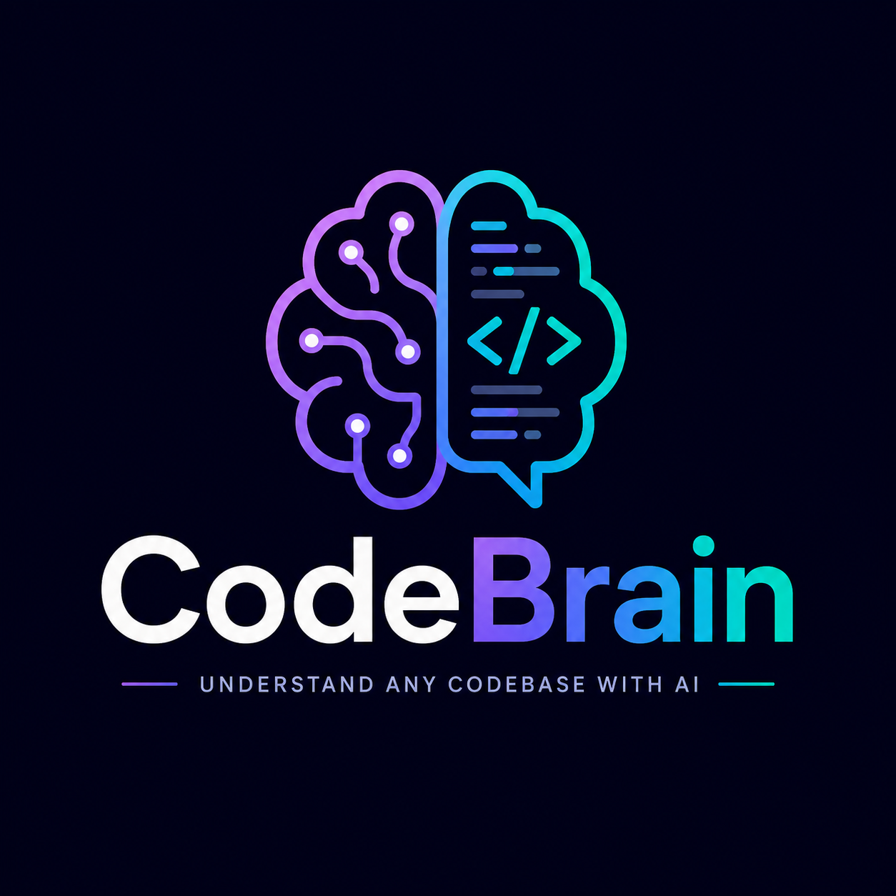

<div align="center">
  

  <h1>CodeBrain</h1>
  <p><strong>Understand any codebase with AI.</strong></p>

  <p>
    Point CodeBrain at any public GitHub repository and ask it anything about the code —
    how a feature works, where logic lives, what a function does, how pieces connect.
    No more getting lost in unfamiliar codebases.
  </p>

  
  
  
</div>

---

## What is CodeBrain?

Most developers have been there — dropped into a large codebase with no idea where to start. You read file after file, follow imports, trace function calls, and still feel lost after an hour.

CodeBrain fixes that. Give it a GitHub repo URL and ask your questions in plain language. It understands the code semantically — not just as text, but as structured logic — and finds the relevant parts for you.

> **Currently in active development. Core services are built. Embeddings and chat interface are next.**

---

## How It Works

```
GitHub Repo URL
      ↓
  Fetch all files via GitHub API
      ↓
  Parse each file into semantic chunks (functions, classes, imports)
      ↓
  Generate embeddings for each chunk        ← coming soon
      ↓
  Store in vector database                  ← coming soon
      ↓
  Query with natural language               ← coming soon
      ↓
  Get precise, context-aware answers
```

---

## What's Built

### GitHub Ingestion

Fetches every relevant file from any public GitHub repository.

- Recursive tree fetch — one API call gets the entire file structure
- Smart filtering — skips binaries, images, lock files, build artifacts, and generated folders
- Batched parallel fetching — 10 files at a time with rate limit awareness
- Handles large repos gracefully with truncation detection

### Semantic Chunking

Splits code into meaningful units — not arbitrary line breaks.

- AST-based parsing using `@typescript-eslint/parser`
- Extracts functions, classes, arrow functions, default exports as individual chunks
- Groups all imports into a single context chunk per file
- Preserves file path, line numbers, and chunk type for precise retrieval
- Supports `.ts`, `.tsx`, `.js`, `.jsx`

---

## What's Coming

- [ ] Embeddings generation for each chunk
- [ ] Vector storage and similarity search
- [ ] Natural language query interface
- [ ] Chat UI — ask questions, get answers with source references
- [ ] Support for more languages (Python, Go, Rust)

---

## Tech Stack

| Layer      | Technology                   |
| ---------- | ---------------------------- |
| Backend    | Node.js, Express, TypeScript |
| Frontend   | React, Vite, TypeScript      |
| Parsing    | `@typescript-eslint/parser`  |
| Embeddings | OpenAI (coming soon)         |
| Vector DB  | TBD                          |

---

## Getting Started

> Full setup instructions will be added once the core pipeline is complete.

```bash
git clone https://github.com/kasamthapa/codebrain
cd codebrain

# Server
cd server && npm install
cp .env.example .env  # add your GITHUB_TOKEN and other keys
npm run dev

# Client
cd client && npm install
npm run dev
```

---

## Building in Public

This project is being built entirely in the open. Every week of progress gets documented. Follow along if you're interested in how RAG systems, AST parsing, and vector search come together in a real product.

---

<div align="center">
  <p>Built by <a href="https://github.com/kasamthapa">Aabishkar Thapa</a></p>
</div>
